# cms后台管理系统
在线预览：http://182.61.33.39:3000/

#### 项目介绍
cms后台内容管理系统，基于NodeJs的WEB开发框架koa开发，数据库使用mongodb。主要功能实现对与前台页面内容导航等等的管理（比如一些企业站）。

数据什么的不要在意细节，扒别人的，嗯，乱放上去的。
前、后台的功能要扩展修改的话，可自行修改。

#### 项目预览

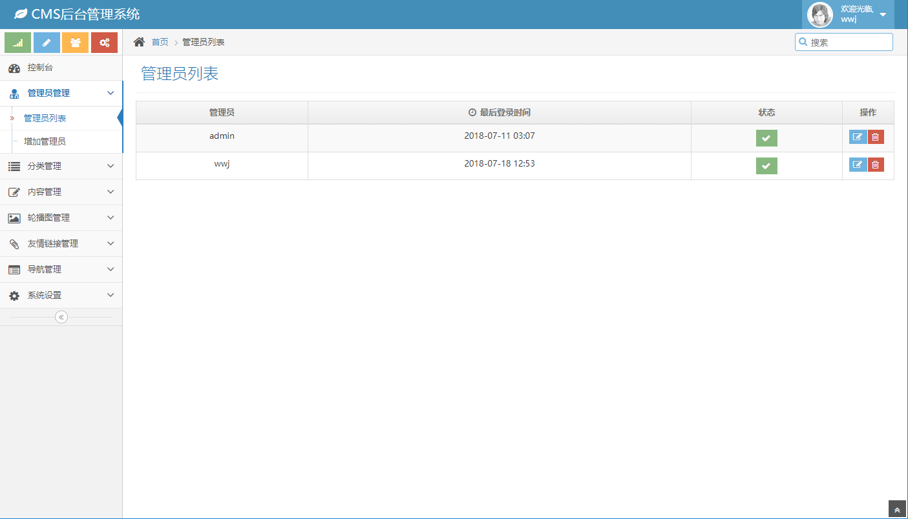
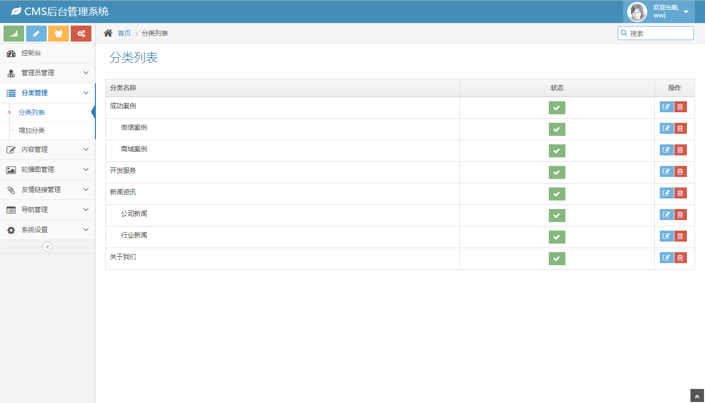
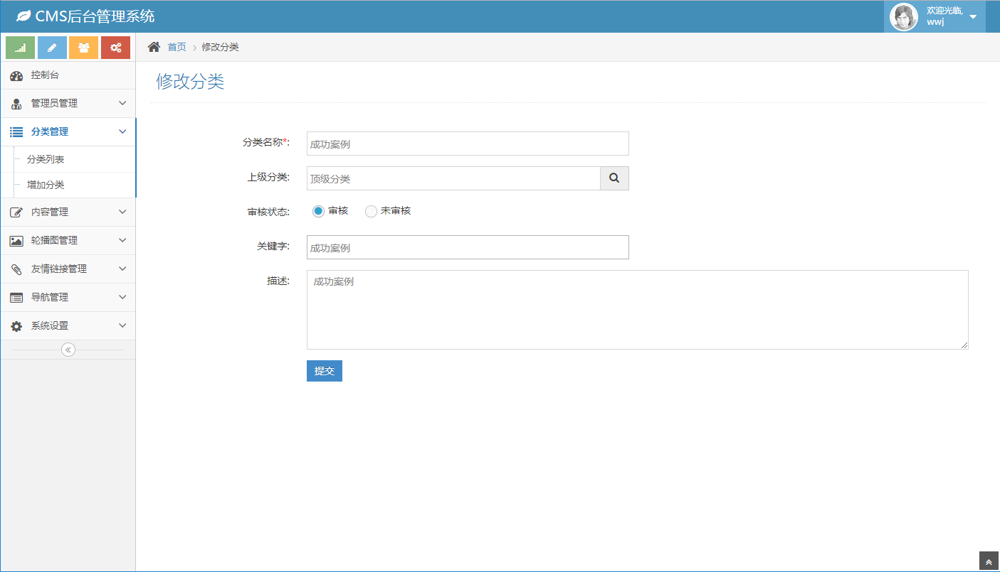
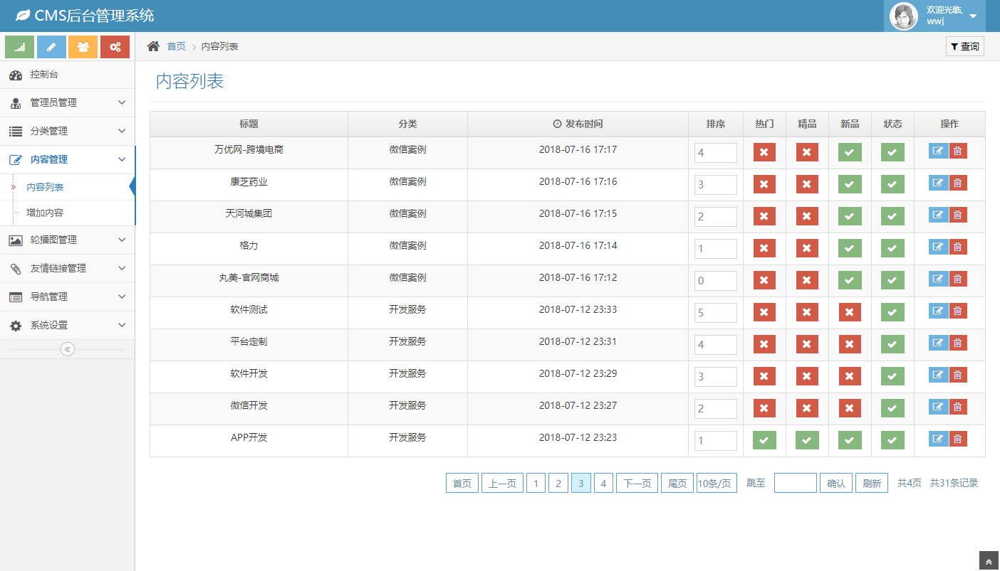
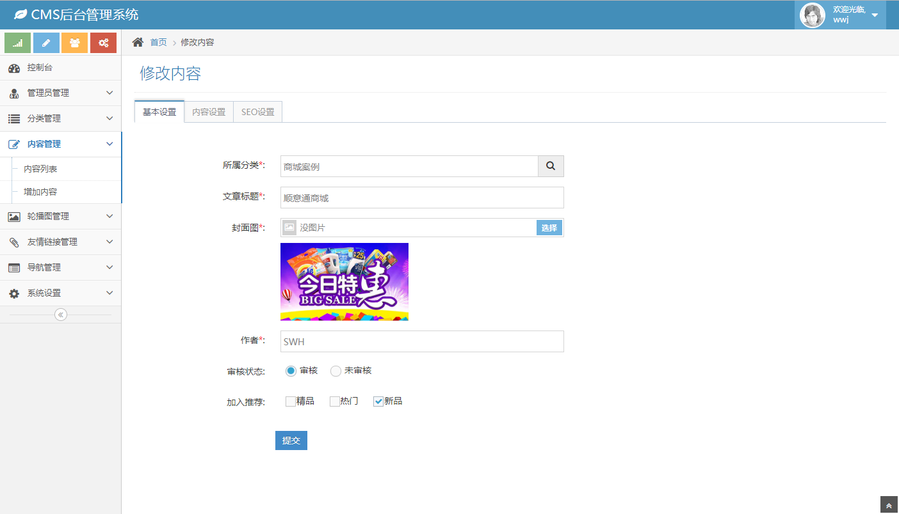
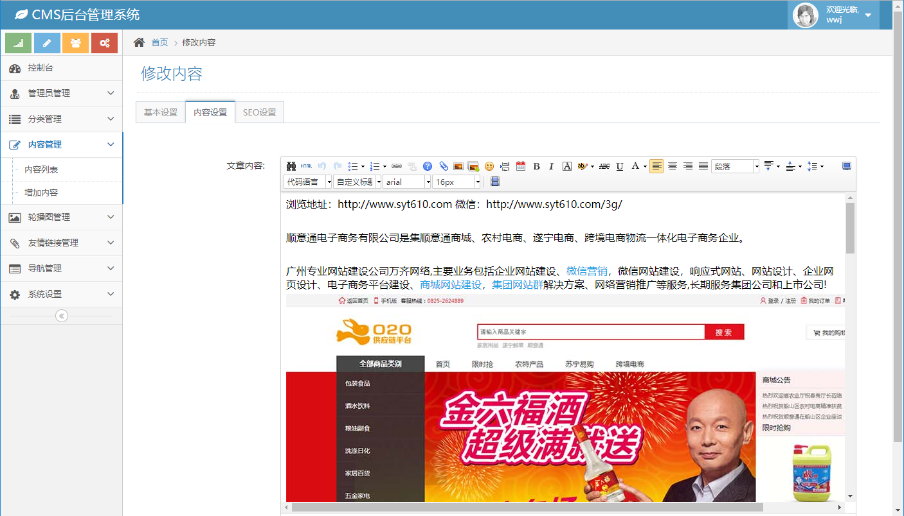
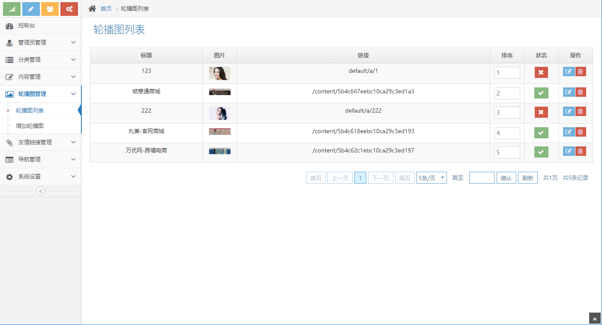
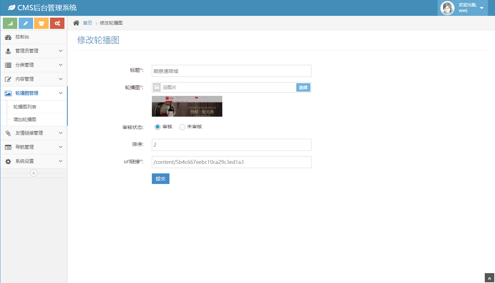
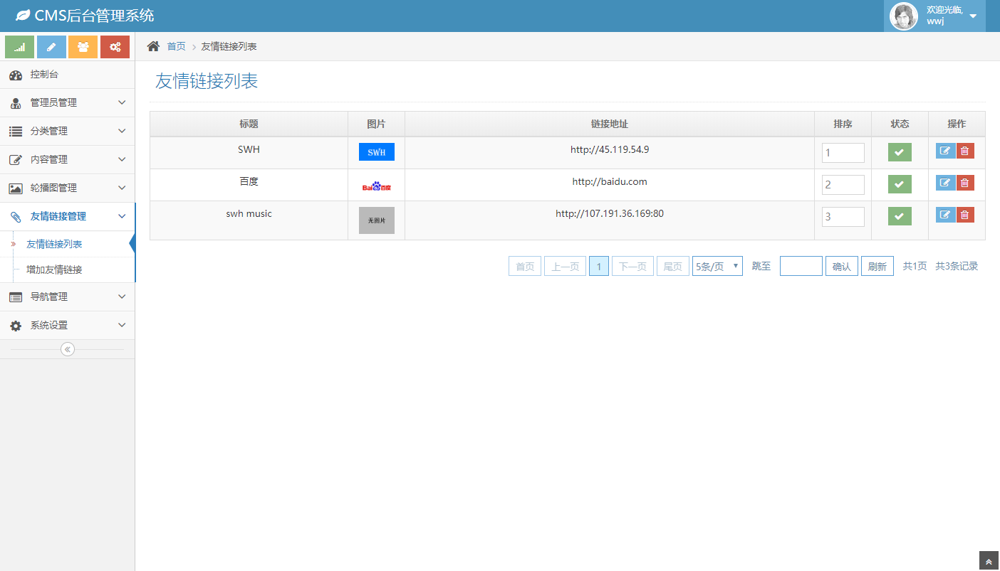
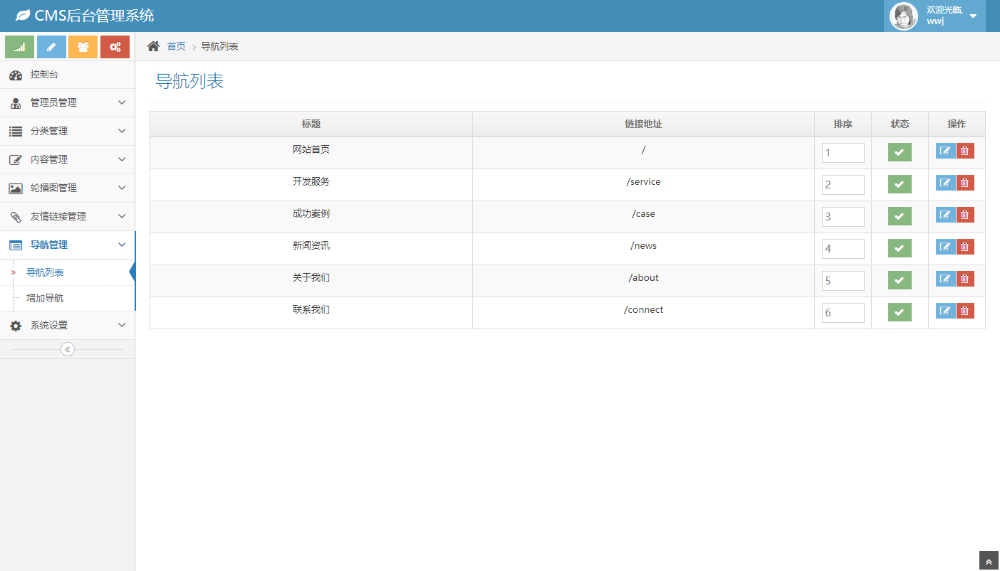


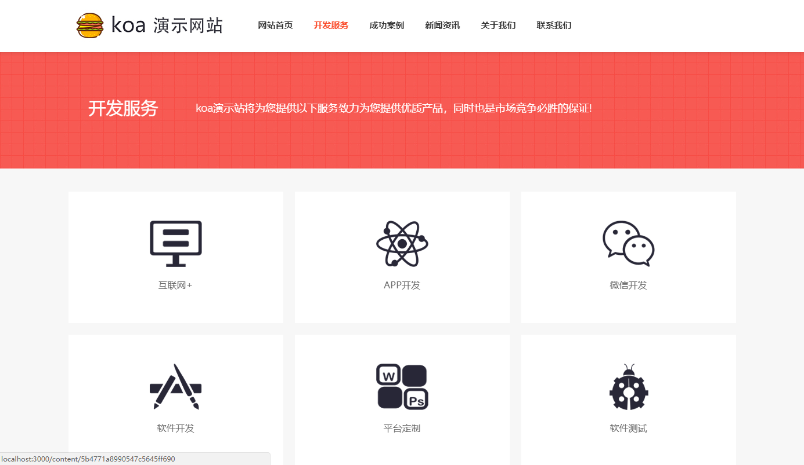

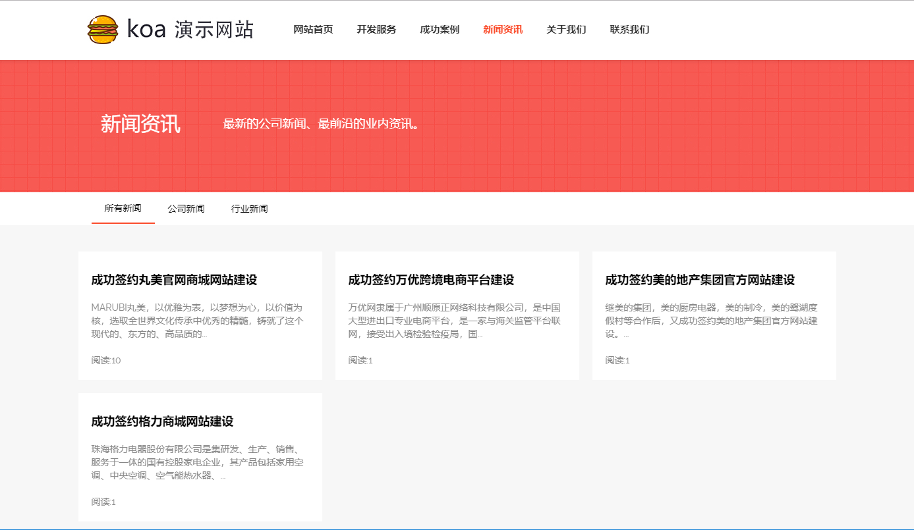
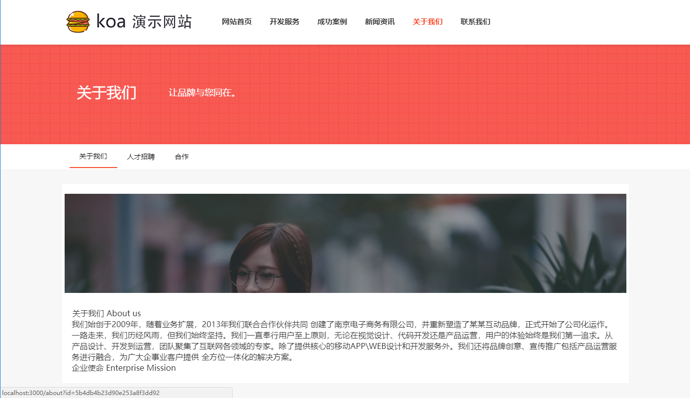
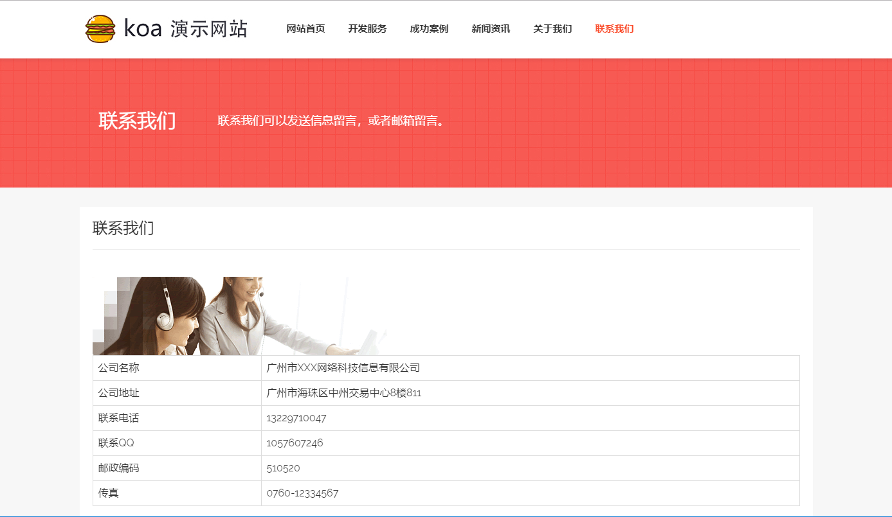
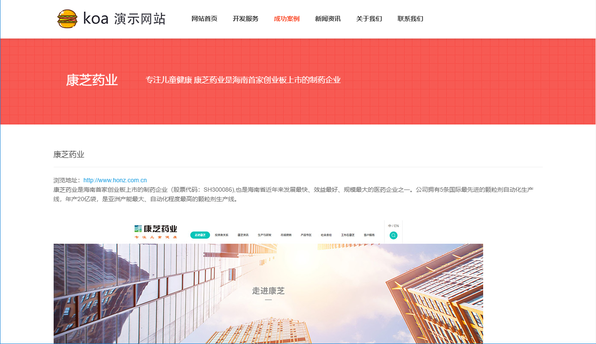

#### 软件架构
软件架构说明

- 后端
    - nodejs
- 前端
    - html5、css3、art-template、jQuery、bootstrap响应式
- 数据库
    - mongodb
- 服务器
    - nodejs-koa2
- 使用技术细分
    - html5、css3、jQuery、ajax、bootstrap响应式、nodejs、koa2、koa-router、koa-session、mongoose、es6、async-await、promise

#### 安装教程

1. 安装了node，并且node的版本>=node v7.6.0 ，或者node支持ES2015及更高版本和 async 方法 ,这里是为了支持koa2的环境
2. 使用 Babel 实现 Async 方法，要在 node < 7.6 版本的 Koa 中使用 async 方法,需要修改所有属于后端的js文件[不建议]。
    ```
    require('babel-register');
    // 应用的其余 require 需要被放到 hook 后面
    const app = require('./app');
    ```
3. 导入数据库
    - 安装mongodb 
    - 开启mongodb
    - 数据文件夹在doc文件夹内
    - mongodb导入：mongorestore -h dbhost -d dbname path 
    - dbhost是mongodb的IP，dbname是数据库的名字，path是doc里的数据库文件夹
    - 如下：
    - mongorestore -h 127.0.0.1 -d koacms ./koacms
4. npm install 或者 yarn install
5. 确认数据库已经开启，然后在根文件夹node app.js就可以了
6. 打开网页
    - 前台链接 http://localhost:3000/
    - 后台链接 http://localhost:/admin
7. 登录后台管理
    - 管理员账号:wwj,密码:123456


#### 使用说明

1. 目录
```
├─doc            相关文件
│  ├─koacms      数据库文件夹
│  └─view
├─model          model
├─node_modules   
├─public         前端页面静态资源
│  ├─admin       后台管理页面静态资源
│  ├─default     前台页面静态资源
│  └─lib
│      └─ueditor  ueditor插件
├─routes
│  ├─admin              后台路由分发
│  │  │
│  │  ├─article.js      内容管理
│  │  ├─articlecate.js  分类管理
│  │  ├─focus.js        轮播图管理
│  │  ├─index.js        admin路由分发
│  │  ├─link.js         友情链接管理
│  │  ├─login.js        登录管理
│  │  ├─manage.js       管理员管理
│  │  ├─nav.js          导航管理
│  │  └─setting.js      系统设置管理
│  │   
│  ├─api.js      外部访问api接口  
│  └─index.js    前台路由
│  │ 
├─statics        文件上传文件夹
│  │ 
└─views          视图
    │
    ├─admin      后台视图文件夹
    │  
    └─default   前台视图文件夹
```
2. mongodb修改链接的数据库名在model文件夹的db.js里
3. 需要增加集合的字段的话，在model文件夹对应的model里修改schema，注：自行学习mongoose的使用
4. 业务逻辑在routes文件夹里，router分发里写了逻辑，没有放到controller里是因为不必要多出多余的require 
5. 接口文档在Wiki这里
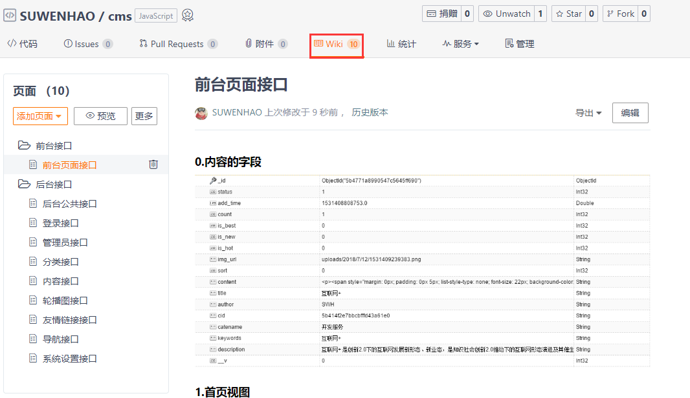
